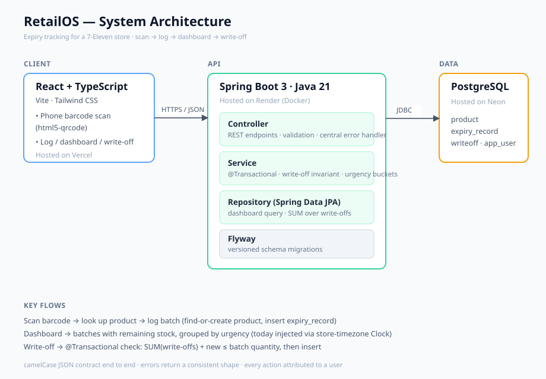

# RetailOS

An expiry-tracking web app that replaces a manual, paper-based workflow in a real 7-Eleven franchise store.

**Live demo:** https://retailos-delta.vercel.app/
**API:** https://retailos-pyk9.onrender.com

> Demo note: the backend runs on a free tier that sleeps when idle, so the first request after a period of inactivity may take ~30–50 seconds to wake. Subsequent requests are fast.

---

## The problem

I manage a 7-Eleven franchise store. Tracking soon-to-expire stock was entirely manual: staff scanned products on the POS just to read the SKU, hand-wrote the SKU and quantity into a physical notebook, and I manually wrote items off from that notebook every week. It was slow, error-prone, and left no data behind.

RetailOS replaces that notebook. Staff scan a product with their phone, log its expiry date and quantity, see what's expiring grouped by urgency, and write items off in one tap — with every action recorded.

## What it does

- **Log expiring stock** — scan a barcode (phone camera) or type it. The first time a barcode is seen, staff enter the product name once; after that it's remembered (SKU memory).
- **Urgency dashboard** — expiring stock grouped into expired / ≤3 days / ≤7 days / ≤14 days / later, each batch shown with its remaining quantity.
- **Write-off workflow** — tap a batch to write off a quantity with a reason (expired / damaged / staff meal). Partial write-offs are supported; a batch disappears from the dashboard once fully written off.

## Tech stack

**Backend:** Java 21, Spring Boot 3 (Web, Data JPA, Security, Validation), PostgreSQL, Flyway migrations
**Frontend:** React + TypeScript + Vite, Tailwind CSS, html5-qrcode (barcode scanning)
**Infrastructure:** Backend on Render (Docker), PostgreSQL on Neon, frontend on Vercel

## Architecture

## Data model

Four core tables:

- **product** — one row per barcode (unique). Holds the remembered name and optional SKU.
- **expiry_record** — one row per logged batch: a product, an expiry date, a quantity, and who logged it. The same product with different expiry dates (or different deliveries) produces separate batches, tracked independently.
- **writeoff** — one row per write-off against a batch, with quantity and reason. A batch's state (active vs gone) is *derived* from its write-offs rather than stored as a status flag.
- **app_user** — staff and managers; every logged action is attributed to a user.

## Design decisions worth calling out

**Partial write-offs and the quantity invariant.** A batch can be written off across multiple events (e.g. some expired, some damaged). Remaining quantity is computed as \`batch.quantity − SUM(writeoffs.quantity)\`. The core invariant — total write-offs can never exceed the batch quantity — is enforced in a \`@Transactional\` service method rather than a single DB constraint, because it spans multiple rows.

**No status column.** Rather than storing an \`active\`/\`written_off\` flag that can drift out of sync, a batch's state is derived from the write-off table. This keeps a single source of truth.

**Dashboard query.** The dashboard returns only batches with remaining stock, computing remaining quantity per batch via a correlated subquery over the write-off table, then buckets them by urgency in the application layer (the date boundaries are pure, independently testable logic). "Today" is injected via an application \`Clock\` set to the store's timezone, so bucketing is deterministic and the server's timezone doesn't skew which items count as expired.

**camelCase JSON contract** end to end between the TypeScript frontend and the Java backend, for a single consumer owned by one developer.

## Running locally

**Prerequisites:** Java 21, Node 20+, Docker (for local PostgreSQL)

\`\`\`bash
# 1. Start a local PostgreSQL
cd backend
docker compose up -d

# 2. Configure environment (see .env example below), then run the backend
./mvnw spring-boot:run        # starts on http://localhost:8080, Flyway applies migrations

# 3. Run the frontend
cd ../frontend
npm install
npm run dev                   # starts on http://localhost:5173
\`\`\`

Backend environment variables (local \`.env\`):
\`\`\`
POSTGRES_DB=retailos
POSTGRES_USER=⟨local-user⟩
POSTGRES_PASSWORD=⟨local-password⟩
\`\`\`

Frontend environment (\`frontend/.env.local\`):
\`\`\`
VITE_API_URL=http://localhost:8080
\`\`\`

## API overview

| Method | Endpoint | Purpose |
|--------|----------|---------|
| \`GET\`  | \`/api/v1/products/barcode/{barcode}\` | Look up a product by barcode (drives the scan form) |
| \`POST\` | \`/api/v1/expiry-records\` | Log a batch of expiring stock (find-or-create product by barcode) |
| \`GET\`  | \`/api/v1/expiry-records/dashboard\` | Expiring stock grouped by urgency, with remaining quantity |
| \`POST\` | \`/api/v1/writeoffs\` | Write off a quantity from a batch |

All errors return a consistent JSON shape (\`timestamp\`, \`status\`, \`errorCode\`, \`message\`, \`path\`) via a central exception handler.

## Status

**Done**
- Core workflow end to end: scan → log → dashboard → write-off
- Deployed and publicly reachable (frontend, backend, database all live)
- Flyway-managed schema, bean validation, centralized error handling
- Quantity invariant enforced transactionally

**In progress**
- Automated tests (unit for urgency bucketing + the write-off invariant; integration with Testcontainers)
- Optimistic-locking protection for concurrent write-offs on the same batch
- Authentication (JWT for managers, PIN for staff) — currently a seeded user

**Deliberately out of scope for now**
- Dashboard caching, scheduled "pull today" job, order-suggestion analytics, multi-store

## About

Built by Desmond Chong Qi Xiang — a CS graduate and working 7-Eleven franchise store manager — as both a solution to a real operational problem and a backend engineering portfolio project. The problem, the workflow, and the first real user all come from the store I run.